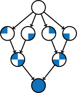

= Start Concurrent: A Gentle Introduction to Concurrent Programming
Barry Wittman <wittman1@otterbein.edu>; Tim Korb <jtk@purdue.edu>; Aditya Mathur <apm@purdue.edu>
:doctype: book
:source-highlighter: rouge
:rouge-style: default
:icons: font
:stem: latexmath
:xrefstyle: short
:listing-caption: Program
:google-analytics-account: G-VEDGKRPMMK

ifdef::ebook-format[:leveloffset: -1]

== New Version in the Works

[WARNING]
.link:https://attacking-problems.github.io/[Attacking Problems with Java]
====
It is summer 2024 and we are updating __Start Concurrent__ with new content and a new title: __Attacking Problems with Java__.  The new version will include many of the enhancements to Java that have been made over the last decade, as well as new chapters on lambda expressions and streams.  While we are maintaining the content on concurrency, we are changing the title to reflect the more general problem solving features of Java.

Like __Start Concurrent__, __Attacking Problems with Java__ is available free on GitHub: https://attacking-problems.github.io/.  We are also considering a print-on-demand version.
====

== Availability

[.text-center]

In addition to a print version available from
link:http://www.thepress.purdue.edu/titles/format/9781626710092[Purdue University Press^] or
link:https://www.amazon.com/Start-Concurrent-Introduction-Problem-Concurrency/dp/1626710090[Amazon^],
__Start Concurrent__ is also available in HTML format for viewing with a web browser.
The HTML version is available both as a single document (which allows for easy searching) and
chunked into a separate document for each chapter (which reduces load time).
Click a link below to access the desired version.

* link:full/index.html[HTML (single document)]
* link:chunked/index.html[HTML (chunked)]

== Using __Start Concurrent__?

If you already use __Start Concurrent__ in your classroom, let us know!  Please e-mail wittman1@otterbein.edu
and tell us what course you use the book for.  If some changes to the book would make your class easier to teach, we'd love to
hear what they are.

We appreciate your feedback and suggestions!
Please submit them either as
a link:https://github.com/start-concurrent/start-concurrent.github.io/issues[Github issue^]
or (for the bold) clone the
link:https://github.com/start-concurrent/start-concurrent.github.io[Github repository^],
make changes to the source code, and submit a pull request.

== About

Welcome to __Start Concurrent__!
This book is intended as an entry point into the challenging realm of multicore computing.
It's designed to introduce students to concurrent programming at the same time they are learning the basics of sequential
programming, early in their college days. After mastering the concepts covered
here, students should be prepared when they encounter more complex forms of
concurrency in advanced courses and in the workplace. A generation of
students who learn concurrency from their first course will be ready to exploit
the full power of multicore chips by the time they join the workforce.

Multicore processors are omnipresent. Whether you use a desktop, a laptop, or even just a smart phone,
chances are that your computer has a multicore chip at its heart. Inexpensive
parallel computers have been prophesied for years. That time has come. Parallel
computers sit on our laps and in our pockets. This progress in microprocessor
technology has thrown a challenge to educators: __How can we teach
concurrent programming?__

Computer programming has been taught in academia for decades. However, the
unwritten goal in nearly every beginning programming class has been teaching
students to write, compile, test, and debug *sequential* programs.
Material related to concurrent programming is often left to courses about
operating systems and programming languages or courses in high performance
computing. Now that parallel computers are everywhere, should we consider
introducing the fundamentals  of concurrent programming in beginner classes in
programming?

For our part, we believe that concurrent programming can be, and should be,
taught to first year students. This book aims at introducing concurrent
programming from almost the first day. The rationale for our belief stems
from another belief that procedural thinking, sequential as well as concurrent,
is natural. People knew how to solve problems in a sequential manner, long
before the study of algorithms became a formal subject and computer science a
formal discipline. And this rationale applies to problem solving using a
collection of sequential solutions applied concurrently. Watch a cook in
the kitchen and you'll see concurrency in action. Watch a movie and you'll
see concurrency in action as various subplots, scenes, and flashbacks weave the
story together. Parents use concurrent solutions to solve day-to-day problems as
they juggle childcare, a career, and a social life.

If people naturally solve problems sequentially and concurrently, why do we need
to teach them programming? Programming is a way to map an algorithmic solution
of a problem to an artificial language such as Java. It's an activity
that requires formal analysis, specialized vocabulary, and razor sharp
logic. The real intellectual substance of programming lies in this
mapping process. What's the best way to transform a sequential solution to an
artificial language? How can a sequential solution be broken into concurrent
parts that run faster than the original? How can a large
problem be divided into small, manageable chunks that can be programmed
separately and then integrated into a whole? In addition, there are issues of
testing, debugging, documentation, and management of the software development
process, which combine to make programming a limitless field for intellectual
effort.

=== Target audience

This book is intended to teach college level students with no programming
experience over a period of two semesters. Although we start with concurrency
concepts from the very beginning, it's difficult for students with no
prior programming experience to write useful multithreaded programs by the end
of their first semester.  By the end of the second semester, however, this book
can lead a student from a blank slate to a capable programmer of complex
parallel programs that exploit the power of multicore processors.

The content in this book could also be used for single semester courses.
Chapters 1 through 12 are intended for the absolute beginner. If you don't want
to introduce concurrent programming in a first course, these chapters should
prove adequate. The concurrency material and exercises in these chapters can be ignored without negatively impacting the other
material. For a second course in programming, Chapters 1 through 12 should be
used as review material as well as an introduction to concurrent programming.
Most material from Chapters 13 onward could then be covered in a single semester.

=== Material covered

Java is a complex language. Its long list of features makes it difficult for
an instructor to decide what to cover and what to leave out. Often there's a
tendency to cover more material than less. We've noticed that today's student
uses not only a textbook but also the large volume of material available on the
web to learn any subject, including programming. Our focus is consequently
more on fundamental elements of programming and less on giving a complete
description of Java, which is itself still a living and evolving language. Where appropriate we direct the student to websites where
relevant reference material can be found.

Classes and objects are an essential part of Java.  Some educators have
adopted an "`objects early`" approach that focuses heavily on object oriented
principles from the very beginning.  Although we see many merits in this
approach, we feel compelled to start with logic, arithmetic, and control flow so
that students have a firm foundation of what to put inside their objects. A full
treatment of classes and objects unfolds throughout the book, moving
naturally from monolithic programs to decomposition into methods to full
object orientation.

=== Organization

The material covered can be divided up in different ways depending on the needs
of the instructor or the student. Chapters 1 through 12, with the exception of
Chapter 7, are designed to introduce the student to Java and programming in
general. Chapters 7 and 15 cover material related to graphical user interfaces
and can be skipped if these topics are not of interest. Chapters 13 and 14 give
an in-depth treatment of the concurrency features of Java.  Although we make an
effort to mark concurrency material and keep it independent from the rest of the
content, those chapters numbered 15 and higher will assume some knowledge and
interest in concurrency. Chapter 15 itself covers debugging and testing, which
is even more crucial in a concurrent environment. The rest of the book covers
advanced material relating to OO design, data structures, and I/O.

=== Chapter layout

One feature of this book that separates it from many Java textbooks is its
problem-driven approach.  Most chapters are divided into the following parts.

Problem:: A motivating problem is given at the beginning
of almost all chapters.  This problem is intended to show the value of the
material covered in the chapter as well as sketching a practical application.
Concepts:: One or more short sections devoted to concepts
is given in each chapter.  The concepts described in these sections are the
fundamental topics covered in the chapter, as well as main ideas needed to solve the chapter's motivating problem. These concepts are intended to be broad and language neutral.  Java syntax is kept to an absolute minimum in these sections.
Syntax:: Each chapter has one or more sections describing
the Java syntax needed to implement the concepts already described in the
Concepts sections.  These sections are typically longer and have numbered
examples in Java code sprinkled throughout.
Solution:: After the appropriate concepts and Java syntax
needed to solve the motivating problem have been given, a solution to the
motivating problem is provided near the end of the chapter.  In this way,
students are given plenty of time to think about the approach needed to solve
the problem before the answer is given.
Concurrency:: For all of the chapters except for
Chapters 13 and 14, the dedicated concurrency chapters, additional relevant
concurrency concepts and syntax are introduced in these specially marked
sections, spreading concurrency throughout the book.
Exercises:: Each chapter ends with exercises, which are
divided into three sections: Conceptual Problems, Programming Practice, and
Experiments. Most Conceptual Problems are simple and are intended as a quick
test of the student's understanding. Problems in Programming Practice require
students to implement a short program in Java and can be used as homework
assignments.  Experiments are a special feature of this textbook and are
especially appropriate in the context of concurrency.  Experiments focus on the performance of a program, usually in terms of speed or memory usage.   Students will need to run short programs and measure their running time or other features, gaining practical insight into speedup and other advantages and challenges of concurrency. References to exercises are given throughout the chapter text.

We hope that structuring chapters in this way can be useful for many different
kinds of readers. Novice programmers may wish to read each chapter from start to
end.  Experienced programmers who have never programmed Java may focus primarily
on the *Syntax* sections to learn the appropriate Java syntax and
semantics. Rusty Java programmers may prefer to focus on the clearly
numbered examples and exercises. Of course, instructors are encouraged to use
the motivating problems to motivate their lectures as well.

In addition, specially marked *Pitfall* sections throughout the book
highlight common programming errors and mistakes.

=== What topics does this book not cover?

This book is not intended to be a comprehensive guide to Java. Instead, it's
intended to teach how to use computers to solve problems, especially
concurrently. Java has a marvelous wealth of packages and libraries that we
don't have the space to cover. For example, the Swing package for
building user interfaces is discussed but not in its entirety. For material not found in this book, we expect students to refer to the material available on the link:http://download.oracle.com/javase/tutorial[Oracle Java tutorial website] and other reference
books and websites.

=== Suggestions

Java IDE:: It's important that the students be introduced to a Java IDE
very early in the course. We recommend that students use a simpler rather than a more complex IDE. We have successfully used DrJava though other simple IDEs
might work just as well. For instructors hoping to give their students
experience with an industry-level IDE, we give examples using Eclipse as well as
DrJava in the chapter on testing and debugging and a few other times when
relevant.
Concurrency at the start:: Many courses begin with a
lecture or two on the relationship between problem-solving and computers.
Chapter 2 covers this topic. During these very early lectures, instructors
can introduce the notions of both sequential and concurrent solutions. One
could use simple problems from areas such as mathematics or physics or even day-to-day life that lead to sequential and concurrent solutions. Early exposure to solutions these problems, programmed in Java, can be beneficial students even if they don't understand all the syntax.
Input and output:: The issue of what input
and output material to cover can be dealt with in several ways. While
programming attractive GUIs may be exciting, some instructors prefer to
postpone detailed treatment of GUI-related material until late in a course. In
this book we've decided to follow a flexible approach. We begin by discussing the use of `System.out.print()` and `Scanner` and the
`JOptionPane` class as alternatives for basic input and output.  Our
assumption is that most instructors will prefer the simplicity of command line
I/O; however, those who favor a more GUI-heavy approach can start early in
Chapter 7 for GUI basics and
eventually move onto Chapter 15 for more depth in GUIs and Swing. Instructors who wish to concentrate only on command line I/O are free to ignore these chapters.

== Acknowledgements

A number of people have played a significant role in motivating the authors to undertake the task of writing this book and in the choice of topics. First, during the spring of 2008, several faculty from the Department of Computer Science and a scientist from Purdue's ITaP, participated in early discussions related to the teaching of concurrent programming in freshman classes. Despite the multitude of issues raised, all participants seemed to agree on one point: that we ought to introduce concurrency early in the Computer Science undergraduate curriculum. Thanks to all the participants, namely, Buster Dunsmore, Ananth Grama, Suresh Jagannathan, Sunil Prabhakar, Faisal Saied, and Jan Vitek.  We benefited from advice, encouragement, and support from a number of alumni and corporate partners; special thanks to Kevin Kahn, Andrew Chien, and Carl Murray.

Thanks to the many anonymous reviewers who carefully read through Draft 3.0 of this manuscript and made valuable suggestions. This current draft would not exist without the many suggestions and critiques of these reviewers.

In the fall of 2008, we offered an experimental freshman class entitled "`Introduction to Programming with Concurrency.`" This class was certainly one of the best we have taught to freshmen.  Thanks to Alexander Bartol, Alexander Coe, Eric Fisher, Benjamin Gilliland-Sauer, John Graff, Tyler Holzer, Kelly, Jordan Kelly, Azfar Khandoker, Zackary Naas, Ravi Pareek, Carl Rhodes, Robert Schwalm, Andrew Wirtz, and Christopher Womble.

Special thanks to Azfar Khandoker who not only attended this initial class, but also worked on an independent study project to create exercises using Lego robots to help students learn programming. Azfar's work has led to the use of robots in two freshman programming classes taught at Purdue.

We appreciate the support and cooperation of the faculty, and their students, who are our first test users: Professor David John of Wake Forest University and Professor Sunil Prabhakar of Purdue University.

Finally, we thank everyone in the open source community who has submitted issues, questions, or pull requests through link:https://github.com/[Github^].